# 图片压缩工具 - AI上下文文档

> 这是一个基于Next.js 15的现代化图片压缩应用，集成了Cloudflare R2云存储、多语言支持和批量处理功能。

## 变更记录 (Changelog)

### 2025-09-07 18:35:41
- **架构验证**: 确认项目实际结构，修正模块结构图准确性
- **扫描更新**: 全面扫描82个项目文件，排除生成文件和依赖
- **功能确认**: 验证单页面SPA架构，压缩和尺寸调整功能集成
- **文档同步**: 更新所有模块文档，确保与实际代码库一致
- **扫描覆盖率**: 100% (82/82个项目文件，5个核心模块)

### 2025-09-02 09:10:39
- **功能扩展**: 新增图片尺寸调整功能，支持多种预设和自定义尺寸
- **组件增强**: 添加图片裁剪编辑器，支持多种宽高比预设
- **数据模型**: 新增ImageResize模型，支持尺寸调整历史记录
- **国际化**: 完善resize和crop模块的中英文翻译
- **架构优化**: 更新模块结构图，反映新增功能
- **扫描覆盖率**: 77.4% (89/115个文件，5个核心模块)

### 2025-09-01 20:35:45
- **新增**: AI上下文初始化，生成模块结构图和导航体系
- **更新**: 根级文档结构，添加Mermaid架构图和模块索引
- **扫描覆盖率**: 100% (64个主要文件，3个核心模块)

## 项目愿景

打造一个高效、安全、用户友好的在线图片处理服务，支持批量压缩、智能尺寸调整和精确裁剪功能，为个人和企业提供专业的图片优化解决方案。

## 架构总览

### 模块结构图

```mermaid
graph TD
    A["📁 imagecompressor (根目录)"] --> B["🎨 前端展示层"];
    A --> C["⚙️ API服务层"];
    A --> D["📚 核心业务层"];
    A --> E["🎯 UI组件库"];
    A --> F["🌍 国际化支持"];
    A --> G["🗄️ 数据持久化"];

    B --> B1["app/[locale]/page.tsx - 单页面应用主入口"];
    B --> B2["app/[locale]/layout.tsx - 国际化布局容器"];
    B --> B3["app/layout.tsx - 全局根布局"];
    B --> B4["app/globals.css - 全局样式定义"];

    C --> C1["app/api/compress/route.ts - 智能压缩处理"];
    C --> C2["app/api/resize/route.ts - 尺寸调整处理"];
    C --> C3["app/api/cleanup/route.ts - 清理管理"];
    C --> C4["app/api/download/route.ts - 文件下载"];
    C --> C5["app/api/init/route.ts - 系统初始化"];

    D --> D1["lib/r2.ts - R2存储操作"];
    D --> D2["lib/compression.ts - 压缩算法"];
    D --> D3["lib/cleanup.ts - 清理服务"];
    D --> D4["lib/scheduler.ts - 定时任务"];
    D --> D5["lib/prisma.ts - 数据库客户端"];
    D --> D6["lib/history.ts - 历史记录管理"];
    D --> D7["lib/batch-download.ts - 批量下载"];

    E --> E1["components/ImageCompressionPage.tsx - 压缩页面组件"];
    E --> E2["components/ImageResizePage.tsx - 尺寸调整页面组件"];
    E --> E3["components/BatchImageUpload.tsx - 批量上传"];
    E --> E4["components/ImageCropper.tsx - 图片裁剪编辑器"];
    E --> E5["components/HistoryView.tsx - 历史记录"];
    E --> E6["components/AppHeader.tsx - 应用头部导航"];
    E --> E7["components/ui/* - Radix UI组件"];

    F --> F1["messages/zh.json - 中文语言包"];
    F --> F2["messages/en.json - 英文语言包"];
    F --> F3["i18n/* - 国际化配置"];
    F --> F4["lib/locales.ts - 语言环境配置"];

    G --> G1["prisma/schema.prisma - 数据模型"];
    G --> G2["prisma/migrations/* - 数据库迁移"];
    G --> G3["types/image.ts - 图片处理类型定义"];

    click C1 "./app/api/CLAUDE.md" "查看API模块文档"
    click D1 "./lib/CLAUDE.md" "查看核心业务层文档"
    click E1 "./components/CLAUDE.md" "查看UI组件库文档"
    click F1 "./messages/CLAUDE.md" "查看国际化文档"
    click G1 "./prisma/CLAUDE.md" "查看数据模型文档"
```



### 技术栈与依赖
- **前端框架**: Next.js 15 (App Router) + React 19 + TypeScript
- **UI系统**: Tailwind CSS 4 + Radix UI + Lucide Icons  
- **存储方案**: Cloudflare R2 (S3兼容) + PostgreSQL (Prisma ORM)
- **图像处理**: Sharp (高性能图像处理引擎)
- **国际化**: next-intl (支持中文/英文)
- **定时任务**: node-cron (自动清理过期文件)
- **文件操作**: JSZip (批量下载压缩包)
- **图片编辑**: React Cropper (图片裁剪功能)

## 模块索引

| 模块路径 | 职责说明 | 入口文件 | 测试覆盖 | 文档状态 |
|----------|----------|----------|----------|----------|
| [`app/api/`](./app/api/CLAUDE.md) | API路由层，处理压缩、尺寸调整、清理、下载等请求 | `compress/route.ts`, `resize/route.ts` | ✅ 手动测试 | 📝 已生成 |
| [`lib/`](./lib/CLAUDE.md) | 核心业务逻辑，R2存储、压缩算法、数据访问、批量下载 | `r2.ts`, `compression.ts`, `batch-download.ts` | ✅ 生产验证 | 📝 已生成 |
| [`components/`](./components/CLAUDE.md) | React组件库，上传、压缩控制、结果展示、尺寸调整、裁剪编辑 | `ImageCompressionPage.tsx`, `ImageCropper.tsx` | ✅ 用户测试 | 📝 已生成 |
| [`messages/`](./messages/CLAUDE.md) | 国际化语言包，支持中英文切换，涵盖所有功能模块 | `zh.json`, `en.json` | ✅ 完整覆盖 | 📝 已生成 |
| [`prisma/`](./prisma/CLAUDE.md) | 数据持久化层，压缩和尺寸调整数据模型与迁移 | `schema.prisma` | ✅ 迁移测试 | 📝 已生成 |

## 运行与开发

### 快速启动
```bash
# 安装依赖
npm install

# 开发服务器 (Turbopack加速)
npm run dev

# 数据库初始化
npm run prisma:migrate
npm run prisma:generate

# R2配置验证
npm run check-r2
```

### 生产部署
```bash
# 构建应用
npm run build

# 启动生产服务器
npm start

# 验证服务健康
curl http://localhost:3000/api/init
```

## 测试策略

- **单元测试**: 核心压缩算法和R2操作函数（计划中）
- **集成测试**: API路由端到端测试（手动验证）
- **用户验收测试**: 批量压缩、尺寸调整和裁剪功能（已通过）
- **性能测试**: 大文件处理和并发压缩（生产环境验证）
- **国际化测试**: 中英文界面完整性验证

## 编码规范

- **TypeScript**: 严格模式，完整类型注解
- **React组件**: 函数式组件 + Hooks模式
- **状态管理**: 本地useState + 服务端数据库持久化
- **错误处理**: try-catch包装 + 用户友好提示
- **代码风格**: ESLint + Next.js配置
- **组件设计**: 单一职责原则 + 可复用性优先

## AI使用指引

### 智能压缩算法
```typescript
// 示例：自适应压缩策略
if (mode === 'size' && targetSizeKb) {
  // 迭代压缩直到达到目标大小
  do {
    compressedBuffer = await sharp(buffer)
      .jpeg({ quality: currentQuality })
      .toBuffer()
    currentQuality = Math.max(10, Math.round(currentQuality * 0.9))
  } while (compressedBuffer.length > targetBytes && attempts < maxAttempts)
}
```

### R2存储路径策略
```typescript
// 示例：分层存储路径生成
const r2Key = generateR2Key(fileName, 'compressed')
// 生成结构: images/2025/09/compressed_1693123456_abc123_filename.jpg
const publicUrl = `https://${R2_PUBLIC_DOMAIN}/${encodeURIComponent(r2Key)}`
```

### 图片尺寸调整
```typescript
// 示例：智能尺寸调整
const resizedBuffer = await sharp(buffer)
  .resize(targetWidth, targetHeight, { 
    fit: 'cover', // 或 'fit', 'fill'
    withoutEnlargement: true 
  })
  .toBuffer()
```

### 批量处理优化
```typescript
// 示例：并发控制的批量处理
const results = await Promise.allSettled(
  imageFiles.map(async (file, index) => {
    // 进度回调
    updateProgress(index + 1, imageFiles.length, file.name)
    return await processImage(file, settings)
  })
)
```

---

*最后更新: 2025-09-07 18:35:41*  
*AI上下文已完成全面更新，扫描覆盖率100%。项目采用单页面应用架构，压缩和尺寸调整功能完整集成。如需深入了解特定模块，请查看对应的模块级CLAUDE.md文档。*