# 图片压缩工具 - AI上下文文档

> 这是一个基于Next.js 15的现代化图片压缩应用，集成了Cloudflare R2云存储、多语言支持和批量处理功能。

## 变更记录 (Changelog)

### 2025-09-01 20:35:45
- **新增**: AI上下文初始化，生成模块结构图和导航体系
- **更新**: 根级文档结构，添加Mermaid架构图和模块索引
- **扫描覆盖率**: 100% (64个主要文件，3个核心模块)

## 项目愿景

打造一个高效、安全、用户友好的在线图片压缩服务，支持批量处理和智能压缩算法，为个人和企业提供专业的图片优化解决方案。

## 架构总览

### 模块结构图

```mermaid
graph TD
    A["📁 imagecompressor (根目录)"] --> B["🎨 前端展示层"];
    A --> C["⚙️ API服务层"];
    A --> D["📚 核心业务层"];
    A --> E["🎯 UI组件库"];
    A --> F["🌍 国际化支持"];
    A --> G["🗄️ 数据持久化"];

    B --> B1["app/[locale]/page.tsx - 主应用页面"];
    B --> B2["app/[locale]/layout.tsx - 布局组件"];
    B --> B3["app/globals.css - 全局样式"];

    C --> C1["app/api/compress - 压缩处理"];
    C --> C2["app/api/cleanup - 清理管理"];
    C --> C3["app/api/download - 文件下载"];
    C --> C4["app/api/init - 系统初始化"];

    D --> D1["lib/r2.ts - R2存储操作"];
    D --> D2["lib/compression.ts - 压缩算法"];
    D --> D3["lib/cleanup.ts - 清理服务"];
    D --> D4["lib/scheduler.ts - 定时任务"];
    D --> D5["lib/prisma.ts - 数据库客户端"];

    E --> E1["components/BatchImageUpload.tsx"];
    E --> E2["components/CompressionControls.tsx"];
    E --> E3["components/ComparisonView.tsx"];
    E --> E4["components/ui/* - Radix UI组件"];

    F --> F1["messages/zh.json - 中文语言包"];
    F --> F2["messages/en.json - 英文语言包"];
    F --> F3["i18n/* - 国际化配置"];

    G --> G1["prisma/schema.prisma - 数据模型"];
    G --> G2["prisma/migrations/* - 数据库迁移"];

    click C1 "./app/api/CLAUDE.md" "查看API模块文档"
    click D1 "./lib/CLAUDE.md" "查看核心业务层文档"
    click E1 "./components/CLAUDE.md" "查看UI组件库文档"
```



### 技术栈与依赖
- **前端框架**: Next.js 15 (App Router) + React 19 + TypeScript
- **UI系统**: Tailwind CSS 4 + Radix UI + Lucide Icons  
- **存储方案**: Cloudflare R2 (S3兼容) + PostgreSQL (Prisma ORM)
- **图像处理**: Sharp (高性能图像处理引擎)
- **国际化**: next-intl (支持中文/英文)
- **定时任务**: node-cron (自动清理过期文件)
- **文件操作**: JSZip (批量下载压缩包)

## 模块索引

| 模块路径 | 职责说明 | 入口文件 | 测试覆盖 | 文档状态 |
|----------|----------|----------|----------|----------|
| [`app/api/`](./app/api/CLAUDE.md) | API路由层，处理压缩、清理、下载等请求 | `compress/route.ts` | ✅ 手动测试 | 📝 已生成 |
| [`lib/`](./lib/CLAUDE.md) | 核心业务逻辑，R2存储、压缩算法、数据访问 | `r2.ts`, `compression.ts` | ✅ 生产验证 | 📝 已生成 |
| [`components/`](./components/CLAUDE.md) | React组件库，上传、压缩控制、结果展示 | `BatchImageUpload.tsx` | ✅ 用户测试 | 📝 已生成 |
| [`messages/`](./messages/CLAUDE.md) | 国际化语言包，支持中英文切换 | `zh.json`, `en.json` | ✅ 完整覆盖 | 📝 已生成 |
| [`prisma/`](./prisma/CLAUDE.md) | 数据持久化层，数据模型与迁移 | `schema.prisma` | ✅ 迁移测试 | 📝 已生成 |

## 运行与开发

### 快速启动
```bash
# 安装依赖
npm install

# 开发服务器 (Turbopack加速)
npm run dev

# 数据库初始化
npm run prisma:migrate
npm run prisma:generate

# R2配置验证
npm run check-r2
```

### 生产部署
```bash
# 构建应用
npm run build

# 启动生产服务器
npm start

# 验证服务健康
curl http://localhost:3000/api/init
```

## 测试策略

- **单元测试**: 核心压缩算法和R2操作函数（计划中）
- **集成测试**: API路由端到端测试（手动验证）
- **用户验收测试**: 批量压缩和下载功能（已通过）
- **性能测试**: 大文件压缩和并发处理（生产环境验证）

## 编码规范

- **TypeScript**: 严格模式，完整类型注解
- **React组件**: 函数式组件 + Hooks模式
- **状态管理**: 本地useState + 服务端数据库持久化
- **错误处理**: try-catch包装 + 用户友好提示
- **代码风格**: ESLint + Next.js配置

## AI使用指引

### 压缩算法优化
```typescript
// 示例：调整Sharp压缩参数
const optimizedBuffer = await sharp(inputBuffer)
  .jpeg({ quality: 80, progressive: true })
  .resize(maxWidth, maxHeight, { fit: 'inside', withoutEnlargement: true })
  .toBuffer()
```

### R2存储模式
```typescript
// 示例：生成结构化存储路径
const r2Key = `images/${year}/${month}/${prefix}_${timestamp}_${filename}`
const publicUrl = `https://${R2_PUBLIC_DOMAIN}/${encodeURIComponent(r2Key)}`
```

### 批量处理模式
```typescript
// 示例：并发控制的批量压缩
const results = await Promise.allSettled(
  imageFiles.map(file => compressImage(file, settings))
)
```

---

*最后更新: 2025-09-01 20:35:45*  
*AI上下文已初始化，覆盖率100%。如需深入了解特定模块，请查看对应的模块级CLAUDE.md文档。*