# 图片压缩工具 - AI上下文文档

> 这是一个基于Next.js 15的现代化图片压缩应用，集成了Cloudflare R2云存储、多语言支持和批量处理功能。

## 变更记录 (Changelog)

### 2025-09-16 15:46:13
- **增量扫描更新**: 自适应AI上下文初始化，发现新增SEO和多语言功能
- **新增模块**: 检测到SEO优化模块(lib/seo.ts)和印地语支持(messages/hi.json)
- **架构增强**: 验证Turbopack构建加速、Schema.org结构化数据、多语言SEO元数据
- **中间件发现**: 国际化路由中间件(middleware.ts)和语言环境配置(lib/locales.ts)
- **组件扩展**: SEO结构化数据组件和语言切换器集成验证
- **扫描覆盖率**: 93.3% (97/104个文件，6个核心模块)

### 2025-09-07 18:35:41
- **架构验证**: 确认项目实际结构，修正模块结构图准确性
- **扫描更新**: 全面扫描82个项目文件，排除生成文件和依赖
- **功能确认**: 验证单页面SPA架构，压缩和尺寸调整功能集成
- **文档同步**: 更新所有模块文档，确保与实际代码库一致
- **扫描覆盖率**: 100% (82/82个项目文件，5个核心模块)

### 2025-09-02 09:10:39
- **功能扩展**: 新增图片尺寸调整功能，支持多种预设和自定义尺寸
- **组件增强**: 添加图片裁剪编辑器，支持多种宽高比预设
- **数据模型**: 新增ImageResize模型，支持尺寸调整历史记录
- **国际化**: 完善resize和crop模块的中英文翻译
- **架构优化**: 更新模块结构图，反映新增功能
- **扫描覆盖率**: 77.4% (89/115个文件，5个核心模块)

### 2025-09-01 20:35:45
- **新增**: AI上下文初始化，生成模块结构图和导航体系
- **更新**: 根级文档结构，添加Mermaid架构图和模块索引
- **扫描覆盖率**: 100% (64个主要文件，3个核心模块)

## 项目愿景

打造一个高效、安全、用户友好的在线图片处理服务，支持批量压缩、智能尺寸调整和精确裁剪功能，为个人和企业提供专业的图片优化解决方案。

## 架构总览

### 模块结构图

```mermaid
graph TD
    A["📁 miniimagecompressor (根目录)"] --> B["🎨 前端展示层"];
    A --> C["⚙️ API服务层"];
    A --> D["📚 核心业务层"];
    A --> E["🎯 UI组件库"];
    A --> F["🌍 国际化支持"];
    A --> G["🗄️ 数据持久化"];
    A --> H["🔧 配置与中间件"];

    B --> B1["app/[locale]/page.tsx - 多语言SPA主入口"];
    B --> B2["app/[locale]/layout.tsx - 国际化布局容器"];
    B --> B3["app/layout.tsx - 全局根布局"];
    B --> B4["app/globals.css - 全局样式定义"];

    C --> C1["app/api/compress/route.ts - 智能压缩处理"];
    C --> C2["app/api/resize/route.ts - 尺寸调整处理"];
    C --> C3["app/api/cleanup/route.ts - 清理管理"];
    C --> C4["app/api/download/route.ts - 文件下载"];
    C --> C5["app/api/init/route.ts - 系统初始化"];

    D --> D1["lib/r2.ts - R2存储操作"];
    D --> D2["lib/compression.ts - 压缩算法"];
    D --> D3["lib/cleanup.ts - 清理服务"];
    D --> D4["lib/scheduler.ts - 定时任务"];
    D --> D5["lib/prisma.ts - 数据库客户端"];
    D --> D6["lib/history.ts - 历史记录管理"];
    D --> D7["lib/batch-download.ts - 批量下载"];
    D --> D8["lib/seo.ts - SEO元数据生成"];
    D --> D9["lib/locales.ts - 语言环境配置"];

    E --> E1["components/ImageCompressionPage.tsx - 压缩页面组件"];
    E --> E2["components/ImageResizePage.tsx - 尺寸调整页面组件"];
    E --> E3["components/BatchImageUpload.tsx - 批量上传"];
    E --> E4["components/ImageCropper.tsx - 图片裁剪编辑器"];
    E --> E5["components/HistoryView.tsx - 历史记录"];
    E --> E6["components/AppHeader.tsx - 应用头部导航"];
    E --> E7["components/StructuredData.tsx - SEO结构化数据"];
    E --> E8["components/LanguageSwitcher.tsx - 语言切换器"];
    E --> E9["components/ui/* - Radix UI组件"];

    F --> F1["messages/zh.json - 中文语言包"];
    F --> F2["messages/en.json - 英文语言包"];
    F --> F3["messages/hi.json - 印地语语言包"];
    F --> F4["i18n/* - 国际化配置"];

    G --> G1["prisma/schema.prisma - 数据模型"];
    G --> G2["prisma/migrations/* - 数据库迁移"];
    G --> G3["types/image.ts - 图片处理类型定义"];

    H --> H1["middleware.ts - 国际化路由中间件"];
    H --> H2["next.config.ts - Next.js配置"];
    H --> H3["tailwind.config.* - Tailwind配置"];

    click C1 "./app/api/CLAUDE.md" "查看API模块文档"
    click D1 "./lib/CLAUDE.md" "查看核心业务层文档"
    click E1 "./components/CLAUDE.md" "查看UI组件库文档"
    click F1 "./messages/CLAUDE.md" "查看国际化文档"
    click G1 "./prisma/CLAUDE.md" "查看数据模型文档"
```



### 技术栈与依赖
- **前端框架**: Next.js 15 (App Router) + React 19 + TypeScript + Turbopack
- **UI系统**: Tailwind CSS 4 + Radix UI + Lucide Icons
- **存储方案**: Cloudflare R2 (S3兼容) + PostgreSQL (Prisma ORM)
- **图像处理**: Sharp (高性能图像处理引擎)
- **国际化**: next-intl (支持中文/英文/印地语)
- **定时任务**: node-cron (自动清理过期文件)
- **文件操作**: JSZip (批量下载压缩包)
- **图片编辑**: React Cropper (图片裁剪功能)
- **SEO优化**: Schema.org结构化数据 + OpenGraph元数据

## 模块索引

| 模块路径 | 职责说明 | 入口文件 | 测试覆盖 | 文档状态 |
|----------|----------|----------|----------|----------|
| [`app/`](./app/) | 前端展示层和API路由层，处理SPA页面和RESTful API | `[locale]/page.tsx`, `api/*/route.ts` | ✅ 手动测试 | 📝 API已生成 |
| [`lib/`](./lib/CLAUDE.md) | 核心业务逻辑，R2存储、压缩算法、SEO优化、数据访问 | `r2.ts`, `compression.ts`, `seo.ts` | ✅ 生产验证 | 📝 已生成 |
| [`components/`](./components/CLAUDE.md) | React组件库，UI交互、SEO组件、语言切换器 | `ImageCompressionPage.tsx`, `StructuredData.tsx` | ✅ 用户测试 | 📝 已生成 |
| [`messages/`](./messages/CLAUDE.md) | 国际化语言包，支持中英印三语切换，涵盖所有功能模块 | `zh.json`, `en.json`, `hi.json` | ✅ 完整覆盖 | 📝 已生成 |
| [`prisma/`](./prisma/CLAUDE.md) | 数据持久化层，压缩和尺寸调整数据模型与迁移 | `schema.prisma` | ✅ 迁移测试 | 📝 已生成 |
| [`i18n/`](./i18n/) | 国际化配置层，next-intl配置和中间件 | `index.ts`, `config.ts` | ✅ 路由测试 | ⚠️ 待补充 |

## 运行与开发

### 快速启动
```bash
# 安装依赖
npm install

# 开发服务器 (Turbopack加速)
npm run dev

# 数据库初始化
npm run prisma:migrate
npm run prisma:generate

# R2配置验证
npm run check-r2
```

### 生产部署
```bash
# 构建应用 (Turbopack加速)
npm run build

# 启动生产服务器
npm start

# 验证服务健康
curl http://localhost:3000/api/init
```

### 环境变量配置
```bash
# 数据库连接
DATABASE_URL="postgresql://..."

# Cloudflare R2配置
R2_ENDPOINT="https://xxx.r2.cloudflarestorage.com"
R2_ACCESS_KEY_ID="xxx"
R2_SECRET_ACCESS_KEY="xxx"
R2_BUCKET_NAME="xxx"
R2_PUBLIC_DOMAIN="xxx.domain.com"  # 可选

# SEO配置
NEXT_PUBLIC_BASE_URL="https://www.mycompressor.org"
GOOGLE_SITE_VERIFICATION="xxx"
```

## 测试策略

- **单元测试**: 核心压缩算法和R2操作函数（计划中）
- **集成测试**: API路由端到端测试（手动验证）
- **用户验收测试**: 批量压缩、尺寸调整和裁剪功能（已通过）
- **性能测试**: 大文件处理和并发压缩（生产环境验证）
- **国际化测试**: 中英印三语界面完整性验证
- **SEO测试**: 元数据生成和结构化数据验证

## 编码规范

- **TypeScript**: 严格模式，完整类型注解
- **React组件**: 函数式组件 + Hooks模式
- **状态管理**: 本地useState + 服务端数据库持久化 + localStorage历史
- **错误处理**: try-catch包装 + 用户友好提示
- **代码风格**: ESLint + Next.js配置
- **组件设计**: 单一职责原则 + 可复用性优先
- **国际化**: next-intl标准 + 语言环境管理
- **SEO优化**: 结构化数据 + 多语言元数据

## AI使用指引

### 智能压缩算法
```typescript
// 示例：自适应压缩策略
if (mode === 'size' && targetSizeKb) {
  // 迭代压缩直到达到目标大小
  do {
    compressedBuffer = await sharp(buffer)
      .jpeg({ quality: currentQuality })
      .toBuffer()
    currentQuality = Math.max(10, Math.round(currentQuality * 0.9))
  } while (compressedBuffer.length > targetBytes && attempts < maxAttempts)
}
```

### R2存储路径策略
```typescript
// 示例：分层存储路径生成
const r2Key = generateR2Key(fileName, 'compressed')
// 生成结构: images/2025/09/compressed_1693123456_abc123_filename.jpg
const publicUrl = `https://${R2_PUBLIC_DOMAIN}/${encodeURIComponent(r2Key)}`
```

### 多语言SEO优化
```typescript
// 示例：多语言SEO元数据生成
const metadata = await generateSEOMetadata({
  title: t("metadata.title"),
  description: t("metadata.description"),
  keywords: t("metadata.keywords"),
  locale: locale,
  url: locale === 'en' ? '' : `/${locale}`
})
```

### 国际化路由配置
```typescript
// 示例：中间件配置
export default createMiddleware({
  locales: ['en', 'zh', 'hi'],
  defaultLocale: 'en',
  localePrefix: "as-needed",
  localeDetection: false
})
```

### 批量处理优化
```typescript
// 示例：并发控制的批量处理
const results = await Promise.allSettled(
  imageFiles.map(async (file, index) => {
    // 进度回调
    updateProgress(index + 1, imageFiles.length, file.name)
    return await processImage(file, settings)
  })
)
```

---

*最后更新: 2025-09-16 15:46:13*
*AI上下文增量扫描完成，扫描覆盖率93.3%。发现新增SEO模块和印地语支持，项目采用单页面应用架构，压缩和尺寸调整功能完整集成。建议补充i18n模块文档和测试覆盖率。*